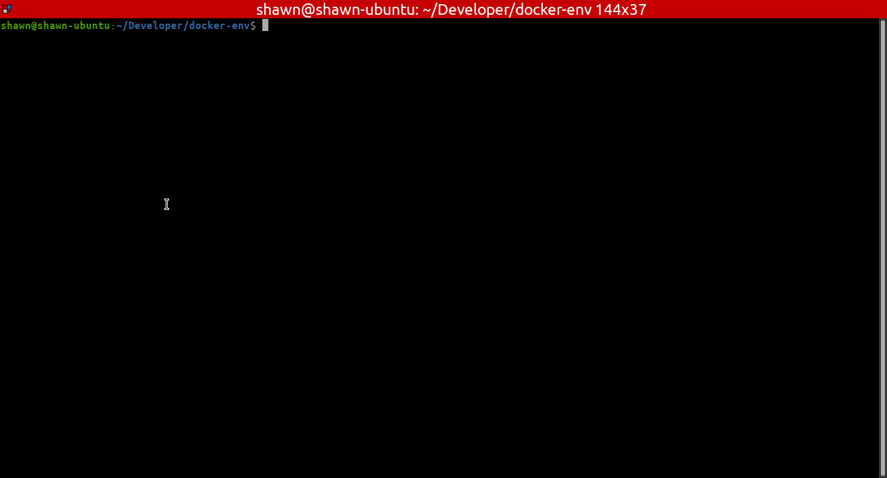

# Docker-based development env

Quick and dirty way to host docker-based development enviornments that can be accessed via SSH or VSCode remote.

This allows you to have multiple develoment enviornments running on a single machine, side-by-side, then you can access them via the excellent [VSCode Remote SSH support](https://code.visualstudio.com/docs/remote/ssh).

Mostly a project to understand and learn what it takes to host an environment.

The containers will have a home directory that is mounted external (at ./home of this dir) so files here will persist across restarts.




## Setup

You can use the Dockerfile at `./build/Dockerfile` or customize it, but it must preserve the end part (see WARNING in the Dockerfile) that sets up user, ssh, etc.  To make this project better, it might be worth refactoring that out or, better yet, baking all of this into a base Docker image that contains all of the required steps and additional layers can then easily add packages or other commands.

To run multiple side by side, simply give them different container names, e.g. `docker-env start shawn shawn_project1`, `docker-env start shawn shawn_project2`, etc.

## Commands

The `docker-env` command allows building, starting, and upgrading containers.

`docker-env build`

Builds or rebuilds the container.

`docker-env start [user-name] [container name]`

`start` starts a container for the given user, default to current user.  It assumes this user exists on the host.

Optionally you can pass a second arg to specify the container name.  Else it defaults to `user_env`, like "shawn_env"

This will output the port for the newly created container.

`docker-env connect [container-name] [user-name]`

SSH connect to the container, optionally with user name: `docker-env connect shawn_env`

`docker-env upgrade`

Updates all running containers to the latest build and then restarts them.  Use this if you've made changes to Dockerfile.

## Usage

Start a container, then connect to it.

```
$ ./docker-env start shawn
Created container shawn_env
Running.  SSH: 0.0.0.0:32792

$ ./docker-env connect shawn_env
Linux 082d61bdc62c 5.4.0-42-generic #46-Ubuntu SMP Fri Jul 10 00:24:02 UTC 2020 x86_64

The programs included with the Debian GNU/Linux system are free software;
the exact distribution terms for each program are described in the
individual files in /usr/share/doc/*/copyright.

Debian GNU/Linux comes with ABSOLUTELY NO WARRANTY, to the extent
permitted by applicable law.
Last login: Mon Sep 21 17:06:49 2020 from 172.17.0.1
shawn@082d61bdc62c:~$ go version
go version go1.14.2 linux/amd64
shawn@082d61bdc62c:~$ ^C
shawn@082d61bdc62c:~$ 

```

